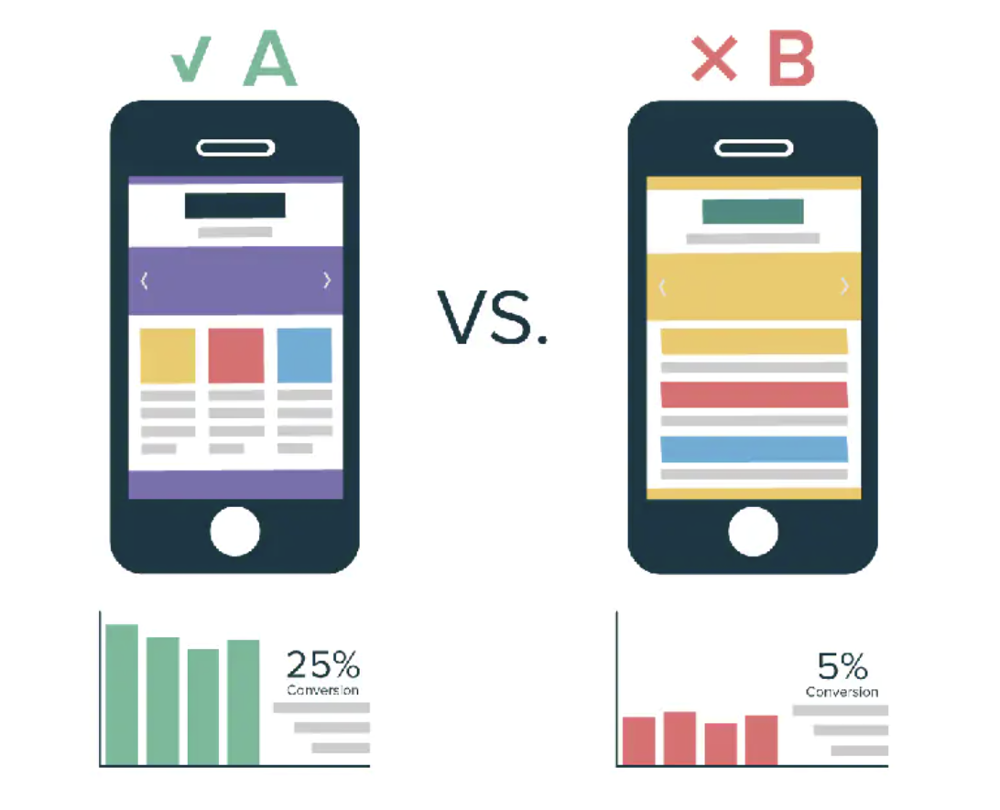
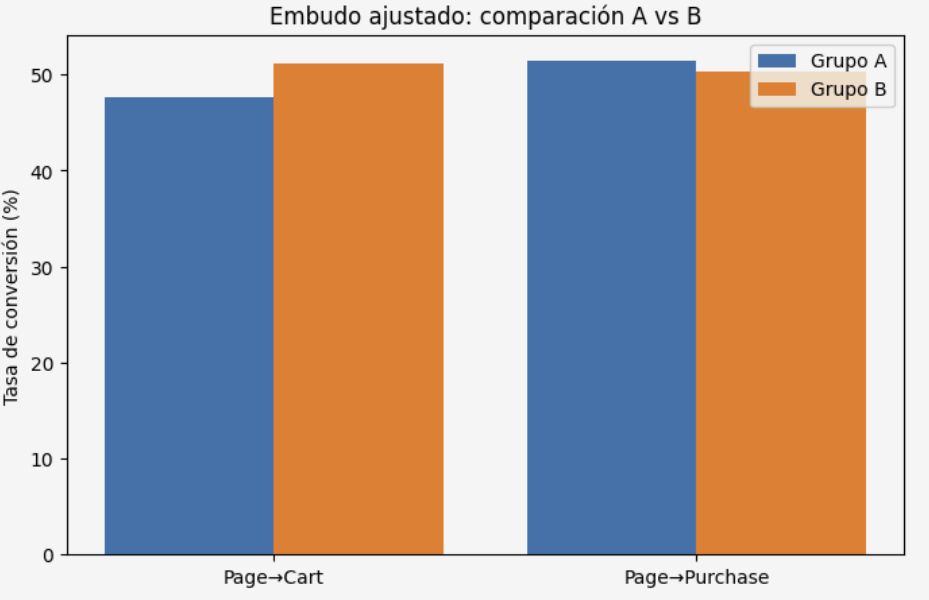

**Project Overview:**
This project analyzes the impact of a new recommender system through an A/B test conducted by an international online store. The experiment compared a control group (Group A) with a test group (Group B) to measure improvements in the conversion funnel: product_page → product_cart → purchase.

The test ran in December 2020 with over 13,000 participants, exceeding the expected sample size. The analysis included data validation, funnel construction, and statistical testing (z-test for proportions) to determine whether the new system achieved the targeted +10% uplift in conversions.

The project highlights both technical skills in data analysis and the ability to interpret experimental results critically, providing actionable insights for business decision-making.

## Objectives

- Validate improvements in the conversion funnel (*product_page → product_cart → purchase*).  
- Measure whether the new system achieved at least a **+10% increase** at each stage.  
- Assess the correct implementation of the test and the quality of the data. 

**Methodology:**  
- Exploratory Data Analysis (EDA): cleaning, duplicate detection, and event distribution analysis.  
- Construction of the conversion funnel for Group A (control) and Group B (new funnel).  
- Application of a **z-test for proportions** to evaluate statistical differences.  

2**Results:**  
- Group B performed better in the *Page → Cart* stage (51.1% vs. 47.7%), statistically significant.  
- In *Cart → Purchase*, an anomaly was detected (A >100%), indicating direct purchases without going through the cart.  
- In *Page → Purchase*, Group A had a slight advantage (51.5% vs. 50.4%), but the difference was not significant (p ≈ 0.286).  

*Comparison of conversion rates between Group A and Group B.* 

## Final Conclusions of the A/B Experiment

1. **Sample Validation**  
   - Actual audience: 13,638 participants (more than double the expected ≈6,000).  
   - Geographic composition differed from design: 98.7% EU vs. 15% expected.  
   - Inclusion period started correctly (Dec 7, 2020) but ended two days earlier than planned (Dec 30 vs. Jan 1).  
   - Results mainly reflect European users’ behavior and should be interpreted with caution.  

2. **Conversion by Funnel Stages**  
   - *Page → Cart*: Group B performed better (51.1% vs. 47.7%), statistically significant.  
   - *Cart → Purchase*: anomaly (A >100%), indicating direct purchases without cart.  
   - *Page → Purchase*: Group A had a slight advantage (51.5% vs. 50.4%), but not significant (p ≈ 0.286).  

3. **Relative Uplift**  
   - Group A showed a +2.23% uplift compared to Group B in final conversion.  
   - This improvement is not statistically significant, so we cannot conclude that the recommender system had a real impact on purchases.  

## Technology Stack

- **Programming Language:** Python  
- **Data Analysis & Manipulation:** Pandas, NumPy  
- **Visualization:** Matplotlib, Seaborn  
- **Statistical Testing:** SciPy (z-test for proportions)  
- **Environment:** Jupyter Notebook  
- **Version Control:** Git/GitHub  

## Outcome

The new recommender system showed partial improvements in the funnel but did not achieve a statistically significant impact on final conversion. Further testing and adjustments are recommended to address anomalies and validate effectiveness.

