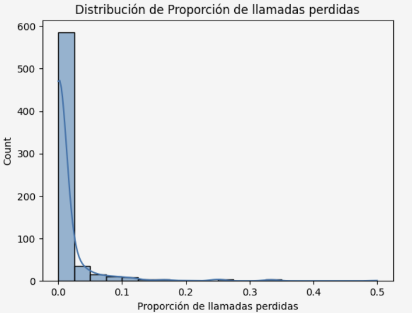
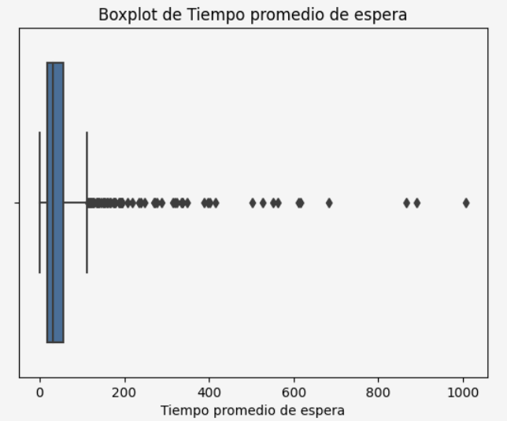
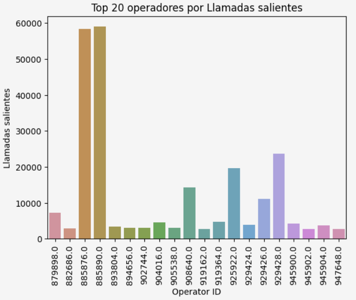
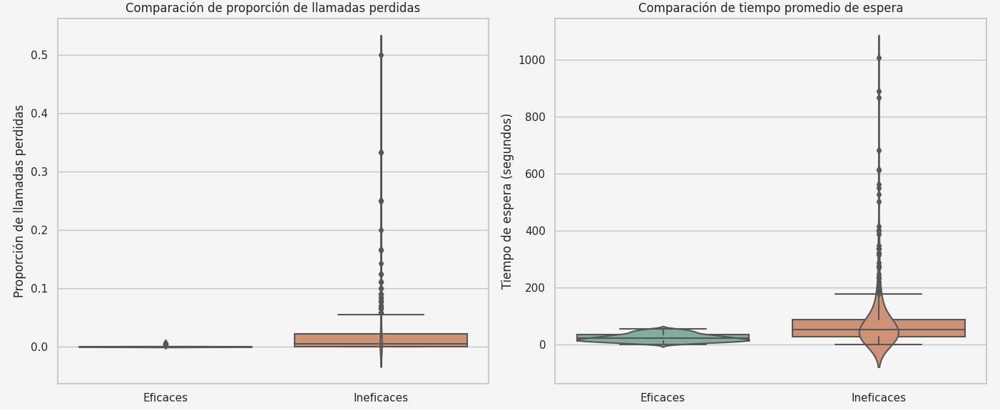

## Project Overview
The virtual telephony service **CallMeMaybe** needed a way to provide supervisors with insights about inefficient operators.  
An operator is considered inefficient if they:
- Miss a high proportion of incoming calls (internal or external).  
- Have long average waiting times for incoming calls.  
- Perform very few outgoing calls (when expected to do so).  

This project focused on exploratory data analysis, operator classification, and statistical validation to identify inefficiencies and provide actionable recommendations.

## Objectives
1. Conduct exploratory data analysis of call records.  
2. Define metrics per operator: missed call ratio, average waiting time, outgoing calls.  
3. Establish statistical thresholds (percentiles) to classify operators as efficient or inefficient.  
4. Rank inefficient operators by severity.  
5. Validate differences using hypothesis testing.  

## Methodology
- **Data Cleaning:** Removed duplicates and normalized column names.  
- **Exploration:** Calculated key metrics per operator.  
- **Thresholds:** Applied p75 for missed calls and waiting time, p25 for outgoing calls.  
- **Classification:** Flagged operators exceeding thresholds as inefficient.  
- **Visualization:** Histograms, boxplots, bar charts, violin plots.  
- **Hypothesis Testing:** Independent t-tests to confirm statistical differences.  

## Results
- **Missed Calls:** Most operators had low ratios, but some reached up to **50% missed calls**.  

- **Waiting Time:** Average waiting times varied widely, with outliers exceeding **1,000 seconds**.  

- **Outgoing Calls:** A few operators performed tens of thousands of calls, while others had fewer than 20.  

- **Ranking:** Top inefficient operators combined high missed ratios, long waiting times, and very low outgoing calls.  

'''text 
operator_id | missed_ratio | avg_waiting_time | outgoing_calls | ineficaz
-------------------------------------------------------------------------------
287         | 913886.0     | 0.500000         | 13.500000      | NaN      | True
467         | 934098.0     | 0.333333         | 31.800000      | NaN      | True
109         | 897872.0     | 0.333333         | 21.666667      | 49.0     | True
497         | 937432.0     | 0.333333         | 12.000000      | 19.0     | True
185         | 904344.0     | 0.250000         | 27.500000      | 5.0      | True
431         | 930242.0     | 0.250000         | 17.250000      | NaN      | True
265         | 910226.0     | 0.250000         | 16.500000      | NaN      | True
80          | 894232.0     | 0.250000         | 14.333333      | 16.0     | True
338         | 919896.0     | 0.200000         | 17.500000      | NaN      | True
33          | 888532.0     | 0.166667         | 32.111111      | 188.0    | True

'''

## Hypothesis Testing and Validation
- **Missed Calls Ratio:** t = 8.45, p-value ≈ 7.7e-16 → significant difference.  
- **Average Waiting Time:** t = 9.39, p-value ≈ 6.9e-19 → significant difference.  

Violin plots further confirm the differences: inefficient operators show higher medians and greater variability in both missed calls and waiting times.  

## Conclusion
1. **Data Cleaning:** Datasets prepared for analysis.  
2. **Exploration:** Key metrics identified (missed calls, waiting time, outgoing calls).  
3. **Results:** Inefficient operators show much higher missed calls (up to 100%), longer waiting times, and very few outgoing calls.  
4. **Validation:** Hypothesis tests confirmed significant differences. Visualizations reinforced findings.  

The classification of inefficient operators is backed by statistical and visual evidence. These operators show clearly inferior performance, justifying their identification as priority improvement targets.

## Outcome and Impact
- **Why it matters:** Inefficient operators reduce customer satisfaction and increase operational costs.  
- **What was achieved:** A robust, percentile-based framework to classify inefficiency, validated statistically.  
- **Impact:** Supervisors can now:  
  - Target training for underperforming operators.  
  - Redistribute workloads to balance efficiency.  
  - Improve customer experience by reducing missed calls and wait times.  

This project demonstrates how **data-driven analysis transforms raw telecom metrics into actionable insights**, bridging technical execution with business outcomes.

## Technology Stack

- **Programming Language:** Python  
- **Libraries:** Pandas, NumPy, Seaborn, Matplotlib, SciPy  
- **Environment:** Jupyter Notebook  
- **Version Control:** Git/GitHub  
- **Visualization Tools:** Tableau

## Additional Materials 
- **Interactive Dashboard:** [Tableau](https://public.tableau.com/shared/5DD4789DS?:display_count=n&:origin=viz_share_link)
