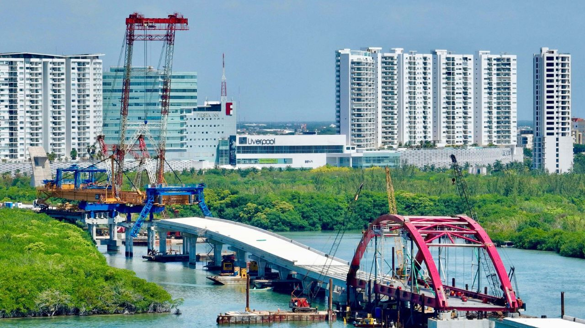

**Project Overview:**
The Nichupté Vehicular Bridge in Cancún is a megaproject spanning over 11 km, connecting the urban area with the hotel zone, and is currently in its final load testing phase. Its management and analysis reveal both benefits in mobility and challenges in terms of cost and execution.

## Objectives

1. Promote efficiency in project management: Implement dashboards and communication plans to improve team coordination and accelerate project timelines.
2. Improve urban mobility: Reduce travel times between the urban and hotel zones of Cancún from 55–90 minutes to approximately 10 minutes.
3. Minimize environmental impact: Implement the top-down construction method to protect Nichupté Lagoon and its ecosystems during construction.

## Features

1. **Project Context:**

- Length: Over 11 km, the longest bridge over a lagoon in Mexico.
- Location: Connects Luis Donaldo Colosio Boulevard with the Cancún hotel zone.

2. **Impact Analysis:**

*Benefits:*

- Mobility: drastic reduction in travel times between the urban and hotel zones.
- Capacity: designed to handle up to 20,000 vehicles daily.
- Security: will feature intelligent systems connected to a C4 command center for real-time     monitoring.
- Tourism: improves accessibility to the hotel zone, a key driver of the local economy.

3. **Challenges:**

- Cost overruns and irregularities: The Federal Auditor's Office identified discrepancies totaling more than 95 million pesos.
- Delays: The project is more than two years behind schedule.
- Massive databases

## Technology Stack

- Oracle: Databases, Calendars
- Excel: Data and Programs
- Python: Data Cleanup
- Power BI: Dashboards
- Synchro
- Microsoft Office

> If you would like to find out more about the project and the implementation of technologies, you can look for [Vías Terrestres magazine #83 (32–40)](https://issuu.com/viasterrestres/docs/vt_83).

## Outcome

The Nichupté Bridge is a landmark project that will transform mobility in Cancún, but its management reveals tensions between the promised efficiency and the challenges of execution and transparency. For a professional analysis, it is important to highlight both the achievements (reduced construction times, technological integration) and the risks (cost overruns, delays, long-term sustainability).

